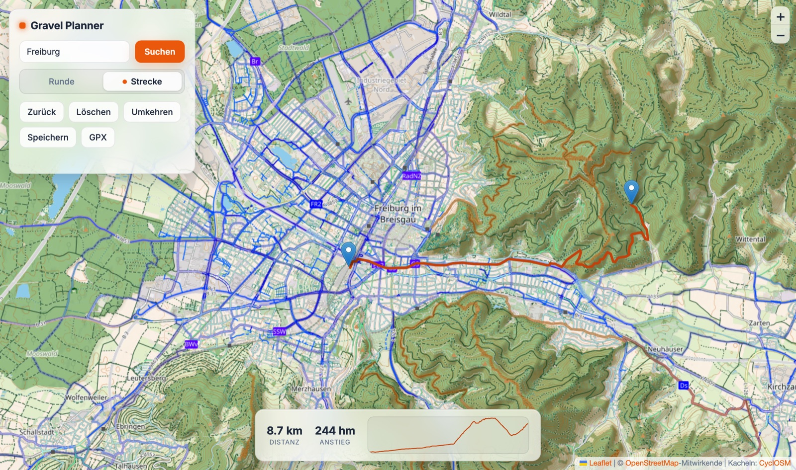

# Gravel Planner

Statischer Gravel-Routenplaner (kein Build, kein Backend). Plant Routen bevorzugt
über Schotter- und Waldwege via [BRouter](https://brouter.de) (Profil `gravel`,
Fallback `trekking`) und erzeugt Auto-Rundtouren über
[OpenRouteService](https://openrouteservice.org).

> **Hinweis:** Der **Runde**-Modus (Auto-Rundtouren) benötigt einen kostenlosen
> OpenRouteService-API-Key. Der **Strecke**-Modus läuft ohne Key.
> → [Key einrichten](#openrouteservice-key-für-runde-erforderlich)

## Features

- **Strecke**: Start- und Endpunkt (plus optionale Zwischenpunkte) auf die Karte
  klicken → Routing entlang Gravel-Wegen (BRouter); Marker ziehen/löschen, Zurück, Umkehren.
- **Runde**: einen Startpunkt + Distanzbereich → 3 echte Rundtouren
  (OpenRouteService `round_trip`), klickbar.
- Distanz, Höhenmeter (für Runden robust aus verrauschten SRTM-Höhen berechnet:
  Void-Füllung → Median-Filter → Anstieg per Hysterese), Höhenprofil.
- Ortssuche (Nominatim), Speichern (localStorage), GPX-Export.
- UI passt sich automatisch an Hell-/Dunkel-Modus des Systems an (Glas-Optik).

## Installation

### Voraussetzungen

- **Python 3** — für den Dev-Server (`serve.py`). Alternativ jeder statische HTTP-Server.
- **Node.js ≥ 18** — nur für die Tests.
- Keine npm-Abhängigkeiten, kein Build-Schritt.

### Starten

    git clone https://github.com/DerRemo/gravel-planner.git
    cd gravel-planner
    npm run serve        # oder: python3 serve.py 8123
    # http://localhost:8123 im Browser öffnen

Direktes Öffnen per `file://` funktioniert nicht (ES-Module brauchen HTTP).
Der Dev-Server (`serve.py`) sendet No-Cache-Header — sonst liefert der Browser
nach Code-Änderungen veraltete Module aus.

## OpenRouteService-Key (für „Runde" erforderlich)

Die Auto-Runde nutzt OpenRouteService. Kostenlosen Key auf
<https://openrouteservice.org/dev> anlegen. Beim ersten „Runde erzeugen" fragt
die App einmalig danach und speichert ihn lokal (`localStorage`, `ors.key`) —
er landet nie im Repo. Der Strecken-Modus braucht keinen Key.

## Tests

    npm test   # node --test, Node >= 18

## Hinweise

- BRouter-Public-API und Nominatim haben Rate-Limits — bei Fehlern kurz warten.
- Für intensive Nutzung BRouter selbst hosten: https://github.com/abrensch/brouter
- Runden-Distanz ist immer eine Näherung.
