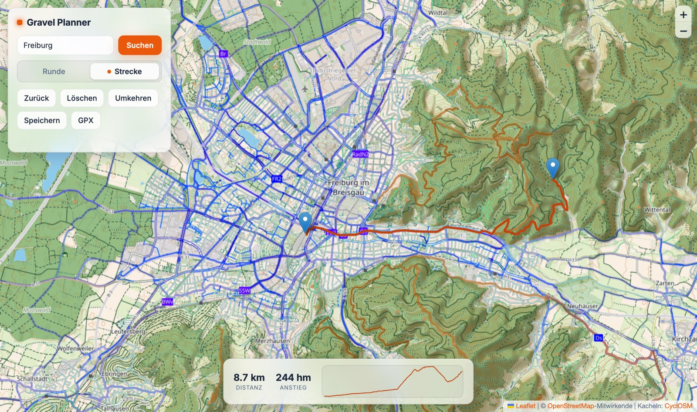

# Gravel Planner

Statischer Gravel-Routenplaner (kein Build, kein Backend). Plant Routen bevorzugt
über Schotter- und Waldwege via [BRouter](https://brouter.de) und erzeugt
manuelle Strecken mit wählbarem BRouter-Profil sowie geschlossene Rundtouren
mit dem eigenen ORS-Profil GravelDeluxe.



> **Hinweis:** Das Profil `gravel-konstant` benötigt den mitgelieferten eigenen
> BRouter. Der lokale Komplettstart erfolgt mit `make setup`.

## Herkunft und Dank

Dieses Projekt basiert auf dem Open-Source-Projekt
[DerRemo/gravel-planner](https://github.com/DerRemo/gravel-planner). Vielen Dank
an DerRemo für den ursprünglichen Gravel-Routenplaner, die schlanke
HTML-/CSS-/JavaScript-Basis und die Veröffentlichung unter der MIT-Lizenz.

**GravelDeluxe** führt diese Arbeit als eigene Erweiterung fort. Der
ursprüngliche Planer bleibt als Grundlage erkennbar; hinzu kommen insbesondere:

- ein lokal betriebener BRouter mit eigenem GravelDeluxe-Profil;
- ein selbst gehosteter
  [openrouteservice](https://github.com/GIScience/openrouteservice) ohne
  externen API-Key;
- das ORS-Profil `gravel-deluxe` mit eigenem Custom-Model;
- Rundkursvorgaben für Distanz, Höhenmeter und grobe Himmelsrichtung;
- lokale OSM-/Routingdaten sowie ein reproduzierbarer Komplettstart;
- Docker-Compose-, Portainer- und Watchtower-Konfiguration für den
  Serverbetrieb.

Änderungen des GravelDeluxe-Projekts sind keine offiziellen Änderungen oder
Empfehlungen des ursprünglichen Autors.

## Features

- **Strecke**: Start- und Endpunkt (plus optionale Zwischenpunkte) auf die Karte
  klicken → Routing entlang Gravel-Wegen (BRouter); Marker ziehen/löschen, Zurück, Umkehren.
- **Runde**: einen Startpunkt sowie Distanz- und Höhenmeterbereich wählen →
  die drei bestpassenden geschlossenen Rundtouren über den selbst gehosteten
  ORS erhalten.
- Optionale grobe Himmelsrichtung lenkt die Hauptausdehnung einer Runde und
  hilft, ungünstige Seiten des Startorts zu meiden.
- Erd-/Gras-Wiesenwege lassen sich zulassen oder ausschließen; die maximale
  Steigung ist einstellbar und beträgt standardmäßig 10 %. Diese Vorgaben
  werden nach der Routenantwort bewertet. Die Oberfläche stammt aus dem beim
  ORS-Graphbau aktivierten Speicher `WaySurfaceType`, die Steigung aus den
  Höhenwerten.
- Beliebige Highlights können auf der Karte gesetzt werden und werden als
  verpflichtende Via-Punkte in die Rundtour eingebaut.
- Distanz, Höhenmeter (für Runden robust aus verrauschten SRTM-Höhen berechnet:
  Void-Füllung → Median-Filter → Anstieg per Hysterese), Höhenprofil.
- Ortssuche (Nominatim), Speichern (localStorage), GPX-Export.
- GPX- und Feedbackdateien als editierbare Planung laden: Rundkurse erhalten
  automatisch verteilte Formpunkte, GPX-Wegpunkte bleiben Pflicht-Highlights.
- Feedback-Modus: Route scrubben, schlechte Passagen per IN/OUT markieren und
  als JSON einschließlich vollständiger Route und Analysemetadaten exportieren.
- Frei wählbarer Routenname für GPX- und Feedback-Export.
- UI passt sich automatisch an Hell-/Dunkel-Modus des Systems an (Glas-Optik).

## Installation

### Voraussetzungen

- **Python 3** — für den Dev-Server (`serve.py`). Alternativ jeder statische HTTP-Server.
- **Node.js ≥ 18** — nur für die Tests.
- Keine npm-Abhängigkeiten, kein Build-Schritt.

### Starten

    git clone https://github.com/GravelDeluxe/gravel-deluxe-planner.git
    cd gravel-deluxe-planner
    make setup           # einmalig: lokalen Routing-Stack einrichten
    npm run serve        # Quellcode mit lokalem Routing, ohne App-Neubau
    # http://localhost:8123 im Browser öffnen

Direktes Öffnen per `file://` funktioniert nicht (ES-Module brauchen HTTP).
Der Dev-Server (`serve.py`) sendet No-Cache-Header — sonst liefert der Browser
nach Code-Änderungen veraltete Module aus. `/brouter` und `/ors` leitet er
an den lokalen Stack auf Port 8086 weiter. Dafür muss der Stack laufen;
Rundtouren benötigen keinen externen API-Key.

### Komplettes lokales System

Mit laufendem Docker Desktop richtet ein Befehl Web-App, eigenen BRouter,
Kartensegmente und einen echten Profiltest ein:

```sh
make setup
```

Danach ist die App unter <http://localhost:8086> erreichbar. Weitere Befehle
zeigt `make help`. Die lokalen `.rd5`-Daten liegen unter
`local-data/segments4` und werden nicht in Git aufgenommen.

## Gravel Konstant und GravelDeluxe

Zusätzlich zum unveränderten Originalprofil steht das neue Profil
`gravel-konstant` als **Gravel Konstant** im Streckenmodus zur Auswahl.
Es bevorzugt zusammenhängende, gut fahrbare
Gravel-Abschnitte, verteuert Hauptstraßen deutlich und bestraft sehr steile
Rampen. Das Profil benötigt einen eigenen BRouter; auf der öffentlichen Instanz
fällt die App automatisch auf `gravel` zurück.

Die App startet im Modus „Runde“ an der Home Base in Bad Rappenau. Rundtouren
kommen aus dem eigenen ORS-Profil `gravel-deluxe`. Es basiert auf dem
`cycling-mountain`-Encoder und ergänzt ein Custom-Model: Hauptstraßen,
Schiebepassagen, Stufen und unpassierbare Wege werden stark abgewertet; ein
guter paralleler Radweg gewinnt knapp gegen einen Track. Zehn native Varianten werden
nach Distanz und Höhenmetern bewertet, die besten drei angezeigt. Manuelle
Strecken verwenden weiterhin das ausgewählte BRouter-Profil.

ORS verwendet den vollständigen Geofabrik-Extrakt Baden-Württemberg. Der
kleinere Extrakt „Regierungsbezirk Stuttgart“ endet zu nah nördlich der Home
Base und kann deshalb keine zuverlässigen Runden Richtung Odenwald erzeugen.

### GPX- und Feedbackanalyse

Die Referenzanalyse verarbeitet alle guten `.gpx`-Dateien und alle mit dem
Feedback-Modus erzeugten `*__feedback.json`-Dateien in `gpx-samples/`:

```sh
make analyze
```

Mit laufendem lokalem ORS werden Referenzen einmalig weggenau auf dessen
Graphkanten gemappt:

```sh
make match-references
make enrich-references
```

Das Matching muss nach jedem ORS-Graphwechsel erneut laufen. Das Artefakt
enthält den Graph-Zeitstempel; Kandidaten verwenden den exakten Kantenvergleich
nur bei demselben Graphstand und fallen sonst auf den geometrischen Vergleich
zurück. Zwei vorhandene Trentino-Routen liegen außerhalb des aktuellen
Baden-Württemberg-Graphs und bleiben deshalb geometrisch bewertet.
Die Anreicherung rekonstruiert jede abgedeckte GPX mit höchstens 50
Stützpunkten und übernimmt Oberfläche, Straßenklasse und Höhenprofil nur ab
70 % geometrischer Übereinstimmung mit dem Originaltrack.

Das reproduzierbare Ergebnis liegt in `data/reference-analysis.json`. Gute
Routen bilden bevorzugte Korridore, markierte schlechte Passagen bilden zu
meidende Korridore. Beim Erzeugen neuer Runden fließt dieses Modell als
zusätzlicher, erklärbarer Faktor in das Kandidatenranking ein:

- Übereinstimmung mit guten Referenzen gibt einen moderaten Bonus;
- Übereinstimmung mit schlechtem Feedback erhält eine deutlich stärkere Strafe;
- Distanz, Höhenmeter und Himmelsrichtung bleiben eigenständige Ziele.

Optionale `.gpx.meta.json`-Dateien ergänzen Region, Saison, Fahrradtyp,
Bewertung, Notizen und Klassen. Bewertungen gewichten gute Korridore;
als Gegenbeispiel markierte Tracks werden als negative Referenz ausgewertet.
Das Modell enthält außerdem robuste Distanz-/Höhenmeter-Zielbereiche und eine
Übersicht der vorhandenen Regionen, Jahreszeiten und Fahrradtypen.

Die guten Referenzrouten definieren zusätzlich den Rahmen für den Touraufbau:
Höhenmeter je 10 km, Doppelbefahrung, enge Richtungswechsel, Kehrtwenden,
Schließungslücke, erster Anstieg sowie gleichmäßige und steile Anstiege. Das
20.–80.-Perzentil liefert die robusten Grenzen. Bei Doppelbefahrung,
Kehrtwenden, steilen Anstiegen, Wechseln und Hauptstraße gilt nur die obere
Grenze; weniger bleibt ausdrücklich gut. Beim Gravelanteil gilt nur die untere
Grenze. Echte Bandbreiten gelten für Höhenmeterdichte und Anstiegslage.
Abweichungen erhöhen den Kandidatenscore nachvollziehbar, bleiben aber weiche
Hinweise. Oberfläche, Hauptstraße und Gravelanteil stammen aus den
15 ausreichend tracktreu auf dem lokalen ORS rekonstruierten Referenzen. Eine
Leave-one-out-Auswertung prüft jede gute Route gegen einen Rahmen, der ohne
genau diese Route berechnet wurde.

„Unnötige Abkürzung“ und „zu viel Zig-Zag“ stehen als eigene
Feedbackkategorien bereit. Unabhängig vom Feedback bewertet das Ranking den
Fahrfluss jeder Route: starke Richtungswechsel, Kehrtwenden und mehrfach
befahrene Passagen erhalten eine Strafe, flüssige Linien werden bevorzugt.
Die eingestellte Maximalsteigung hat Vorrang vor der Maximaldistanz: Die Suche
wird bei Bedarf bis 150 % der gewünschten Obergrenze erweitert und bevorzugt
immer die längere, weniger steile Variante.
Automatisch erzeugte ORS-Formpunkte bleiben intern. Bei einem GPX-Import zeigt
die Karte dagegen die rekonstruierten blauen Formpunkte zum Bearbeiten sowie
gelbe Pflicht-Highlights.
Die Route zeigt Bodenarten abschnittsweise per Farbe und Tooltip sowie
Richtungspfeile. Steigungen über dem Grenzwert erscheinen hellorange, ausgeschlossene
Wiese-/Erde-Passagen braun und kombinierte Verstöße violett. Der permanente
Scrubber im unteren Overlay koppelt Kartenposition, Distanz, aktuelle Höhe und
eine gelbe Positionsmarke im Höhenprofil; markiertes Feedback erscheint gelb.

Der Routenreport nennt bekannte und unbekannte Oberflächen, Wechsel pro 10 km,
Hauptstraßen, Doppelbefahrung sowie erkannte Anstiege. Der erste Anstieg mit
mehr als 20 Höhenmetern kann nach 5–10 km bevorzugt oder als Pflicht behandelt
werden. Die drei Vorschläge zeigen ihre wichtigsten Teilwerte und werden auf
unterschiedliche Geometrien gefiltert.

Feedback ist standardmäßig eine Rankingstrafe entlang der markierten Geometrie.
Nur wenn „Passage künftig sperren“ ausdrücklich gewählt wurde, erzeugt eine
neue Feedbackdatei einen schmalen Vermeidungskorridor. Älteres Feedback und
Hinweise wie Zig-Zag bleiben Rankingfaktoren und sperren keine Nachbarwege.

Ein Feedback-Export wird nach `gpx-samples/` kopiert und anschließend
`make analyze` ausgeführt. Beim nächsten Laden der App nutzt sie das
aktualisierte Modell.
Feedbackdateien enthalten Bodenabschnitte und einen sekundengenauen Zeitstempel
im Dateinamen, sodass mehrere Exporte derselben benannten Route erhalten bleiben.

Highlights werden zunächst in eine gerichtete Grundrunde einsortiert. Zusätzliche
Stützpunkte erhalten deren Grundform, anschließend routet ORS zwingend durch
jedes Highlight zurück zum Start.

Für den Serverbetrieb stehen zwei Container-Images, eine GitLab-CI-Pipeline und
ein Portainer-Stack mit Watchtower bereit. Einrichtung, Volumes, Parameter und
Teststrecken sind in [docs/phase-1-gravel-konstant.md](docs/phase-1-gravel-konstant.md)
dokumentiert.

## Stand und nächste Schritte

Die verbindliche Arbeitsreihenfolge steht in [IMPLEMENTATION_PLAN.md](IMPLEMENTATION_PLAN.md):
App-Stabilität → reproduzierbare Qualitätsmessung → erklärbare Bewertung →
Serverbetrieb → Referenzanalyse und editierbarer GPX-Import.

Gespeicherte Routen enthalten im Format `graveldeluxe-saved-route/v2` das
Routingprofil, Oberflächenabschnitte, Modus, Highlights und alle Zielvorgaben.
Ältere Einträge bleiben lesbar; verlorene Metadaten werden nicht nachträglich
erfunden. Bei Änderungen an Rundenparametern oder Highlights werden Route und
Vorschläge verworfen und müssen neu berechnet werden. Beim Umkehren einer
Runde werden Oberflächen und Höhenmeter aktualisiert.

Unbekannte oder nur teilweise erfasste Oberflächen gelten bei aktivem
Wiese-/Erde-Ausschluss als nicht vollständig prüfbar. Sie werden nicht als
bestätigte Einhaltung der Vorgabe angezeigt.

## Tests

    npm test   # node --test, Node >= 18

## Hinweise

- BRouter-Public-API und Nominatim haben Rate-Limits — bei Fehlern kurz warten.
- Für intensive Nutzung BRouter selbst hosten: https://github.com/abrensch/brouter
- Runden-Distanz ist immer eine Näherung.
